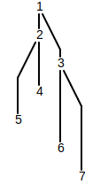
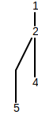

# Managing Forks

The ledger is permitted to fork at slot boundaries. The resulting data structure forms a tree called a _blocktree_. When the fullnode interprets the blocktree, it must maintain state for each fork in the chain. We call each instance an _active fork_. It is the responsibility of a fullnode to weigh those forks, such that it may eventually select a fork.

A fullnode selects a fork by submiting a vote to a slot leader on that fork. The vote commits the fullnode for a duration of time called a _lockout period_. The fullnode is not permitted to vote on a different fork until that lockout period expires. Each subsequent vote on the same fork doubles the length of the lockout period. After some cluster-configured number of votes \(currently 32\), the length of the lockout period reaches what's called _max lockout_. Until the max lockout is reached, the fullnode has the option to wait until the lockout period is over and then vote on another fork. When it votes on another fork, it performs a operation called _rollback_, whereby the state rolls back in time to a shared checkpoint and then jumps forward to the tip of the fork that it just voted on. The maximum distance that a fork may roll back is called the _rollback depth_. Rollback depth is the number of votes required to achieve max lockout. Whenever a fullnode votes, any checkpoints beyond the rollback depth become unreachable. That is, there is no scenario in which the fullnode will need to roll back beyond rollback depth. It therefore may safely _prune_ unreachable forks and _squash_ all checkpoints beyond rollback depth into the root checkpoint.

## Active Forks

An active fork is as a sequence of checkpoints that has a length at least one longer than the rollback depth. The shortest fork will have a length exactly one longer than the rollback depth. For example:

The following sequences are _active forks_:

* {4, 2, 1}
* {5, 2, 1}
* {6, 3, 1}
* {7, 3, 1}

## Pruning and Squashing

A fullnode may vote on any checkpoint in the tree. In the diagram above, that's every node except the leaves of the tree. After voting, the fullnode prunes nodes that fork from a distance farther than the rollback depth and then takes the opportunity to minimize its memory usage by squashing any nodes it can into the root.

Starting from the example above, wth a rollback depth of 2, consider a vote on 5 versus a vote on 6. First, a vote on 5:

The new root is 2, and any active forks that are not descendants from 2 are pruned.

Alternatively, a vote on 6:

The tree remains with a root of 1, since the active fork starting at 6 is only 2 checkpoints from the root.

