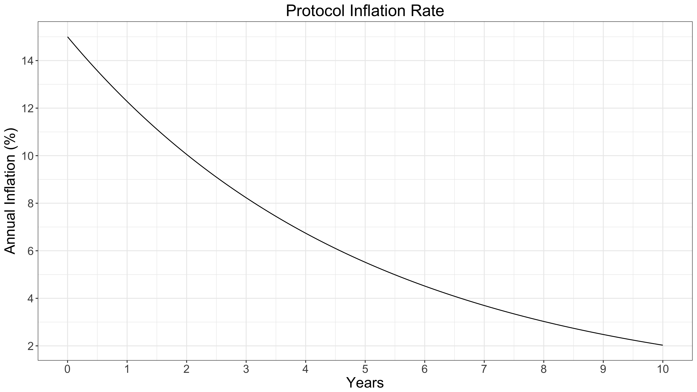
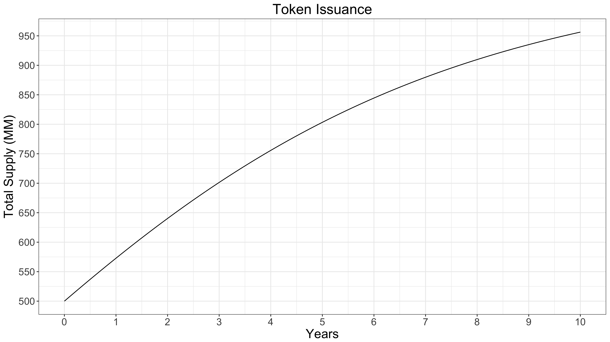

### State-validation protocol-based rewards

Validator-clients have two functional roles in the Solana network:

* Validate (vote) the current global state of that PoH along with any Proofs-of-Replication (see [Replication Client Economics](ed_replication_client_economics.md)) that they are eligible to validate.

* Be elected as ‘leader’ on a stake-weighted round-robin schedule during which time they are responsible for collecting outstanding transactions and Proofs-of-Replication and incorporating them into the PoH, thus updating the global state of the network and providing chain continuity.

Validator-client rewards for these services are to be distributed at the end of each Solana epoch. Compensation for validator-clients is provided via a protocol-based annual inflation rate dispersed in proportion to the stake-weight of each validator (see below) along with leader-claimed transaction fees available during each leader rotation. I.e. during the time a given validator-client is elected as leader, it has the opportunity to keep a portion of each transaction fee, less a protocol-specified amount that is destroyed (see [Validation-client State Transaction Fees](ed_vce_state_validation_transaction_fees.md)). PoRep transaction fees are also collected by the leader client and validator PoRep rewards are distributed in proportion to the number of validated PoReps less the number of PoReps that mismatch a replicator's challenge. (see [Replication-client Transaction Fees](ed_vce_replication_validation_transaction_fees.md))

The effective protocol-based annual interest rate (%) per epoch to be distributed to validation-clients is to be a function of:

* the current global inflation rate, derived from the pre-determined dis-inflationary issuance schedule

* the fraction of staked SOLs out of the current total circulating supply,

* the up-time/participation [% of available slots that validator had opportunity to vote on] of a given validator over the previous epoch.

The first factor is a function of protocol parameters only (i.e. independent of validator behavior in a given epoch) and results in a global validation reward schedule designed to incentivize early participation, provide clear montetary stability and provide optimal security in the network. 

At any given point in time, a specific validator's interest rate can be determined based on the porportion of circulating supply that is staked by the network and the validator's uptime/activity in the previous epoch. For an illustrative example, consider a hypothetical instance of the network with an initial circulating token supply of 250MM tokens with an additional 250MM vesting over 3 years. Additionally an inflation rate is specified at network launch of 7.5%, and a disinflationary schedule of 20% decrease in inflation rate per year (the actual rates to be implemented are to be worked out during the testnet experimentation phase of mainnet launch). With these broad assumptions, the 10-year inflation rate (adjusted daily for this example) is shown in **Figure 2**, while the total circulating token supply is illustrated in **Figure 3**. Neglected in this toy-model is the inflation supression due to the portion of each transaction fee that is to be destroyed.

**Figure 2:** In this example schedule, the annual inflation rate [%] reduces at around 20% per year, until it reaches the long-term, fixed, 1.5% rate.

**Figure 3:** The total token supply over a 10-year period, based on an initial 250MM tokens with the disinflationary inflation schedule as shown in **Figure 2**

Over time, the interest rate, at a fixed network staked percentage, will reduce concordant with network inflation. Validation-client interest rates are designed to be higher in the early days of the network to incentivize participation and jumpstart the network economy. As previously mentioned, the inflation rate is expected to stabalize near 1-2% which also results in a fixed, long-term, interest rate to be provided to validator-clients. This value does not represent the total interest available to validator-clients as transaction fees for both state-validation and ledger storage replication (PoReps) are not accounted for here. 

Given these example parameters, annualized validator-specific interest rates can be determined based on the global fraction of tokens bonded as stake, as well as their uptime/activity in the previous epoch. For the purpose of this example, we assume 100% uptime for all validators and a split in interest-based rewards between validators and replicator nodes of 80%/20%. Additionally, the fraction of staked circulating supply is assummed to be constant. Based on these assumptions, an annualized validation-client interest rate schedule as a function of % circulating token supply that is staked is shown in** Figure 4**.

<!--  -->

**Figure 4:** Shown here are example validator interest rates over time, neglecting transaction fees, segmented by fraction of total circulating supply bonded as stake.

This epoch-specific protocol-defined interest rate sets an upper limit of *protocol-generated* annual interest rate (not absolute total interest rate) possible to be delivered to any validator-client per epoch. The distributed interest rate per epoch is then discounted from this value based on the participation of the validator-client during the previous epoch.
