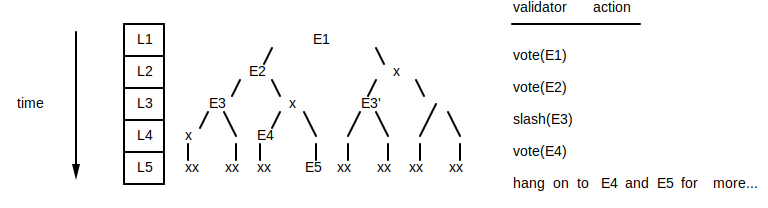

# Fork Generation

The chapter describes how forks naturally occur as a consequence of [leader
rotation](leader-rotation.md).

## Overview

Nodes take turns being leader and generating the PoH that encodes state
changes.  The cluster can tolerate loss of connection to any leader by
synthesizing what the leader ***would*** have generated had it been connected
but not ingesting any state changes.  The possible number of forks is thereby
limited to a "there/not-there" skip list of forks that may arise on leader
rotation slot boundaries.  At any given slot, only a single leader's
transactions will be accepted.

## Message Flow

1. Transactions are ingested by the current leader.
2. Leader filters valid transactions.
3. Leader executes valid transactions updating its state.
4. Leader packages transactions into entries based off its current PoH slot.
5. Leader transmits the entries to validator nodes (in signed blobs)
   1. The PoH stream includes ticks; empty entries that indicate liveness of
      the leader and the passage of time on the cluster.
   2. A leader's stream begins with the tick entries necessary complete the PoH
      back to the leaders most recently observed prior leader slot.
6. Validators retransmit entries to peers in their set and to further
   downstream nodes.
7. Validators validate the transactions and execute them on their state.
8. Validators compute the hash of the state.
9. At specific times, i.e. specific PoH tick counts, validators transmit votes
   to the leader.
   1. Votes are signatures of the hash of the computed state at that PoH tick
      count
   2. Votes are also propagated via gossip
10. Leader executes the votes as any other transaction and broadcasts them to
    the cluster.
11. Validators observe their votes and all the votes from the cluster.

## Partitions, Forks

Forks can arise at PoH tick counts that correspond to a vote.  The next leader
may not have observed the last vote slot and may start their slot with
generated virtual PoH entries.  These empty ticks are generated by all nodes in
the cluster at a cluster-configured rate for hashes/per/tick `Z`.

There are only two possible versions of the PoH during a voting slot: PoH with
`T` ticks and entries generated by the current leader, or PoH with just ticks.
The "just ticks" version of the PoH can be thought of as a virtual ledger, one
that all nodes in the cluster can derive from the last tick in the previous
slot.

Validators can ignore forks at other points (e.g. from the wrong leader), or
slash the leader responsible for the fork.

Validators vote based on a greedy choice to maximize their reward described in
[Tower BFT](tower-bft.md).

### Validator's View

#### Time Progression

The diagram below represents a validator's view of the
PoH stream with possible forks over time.  L1, L2, etc. are leader slots, and
`E`s represent entries from that leader during that leader's slot.  The `x`s
represent ticks only, and time flows downwards in the diagram.

Note that an `E` appearing on 2 forks at the same slot is a slashable
condition, so a validator observing `E3` and `E3'` can slash L3 and safely
choose `x` for that slot.  Once a validator commits to a forks, other forks can
be discarded below that tick count.  For any slot, validators need only
consider a single "has entries" chain or a "ticks only" chain to be proposed by
a leader.  But multiple virtual entries may overlap as they link back to the a
previous slot.

#### Time Division

It's useful to consider leader rotation over PoH tick count as time division of
the job of encoding state for the cluster.  The following table presents the
above tree of forks as a time-divided ledger.

leader slot |  L1 | L2 | L3 | L4 | L5
-------|----|----|----|----|----
data      |  E1| E2 | E3 | E4  | E5
ticks since prev  | | | | x | xx

Note that only data from leader L3 will be accepted during leader slot L3.
Data from L3 may include "catchup" ticks back to a slot other than L2 if L3 did
not observe L2's data.  L4 and L5's transmissions include the "ticks to prev"
PoH entries.

This arrangement of the network data streams permits nodes to save exactly this
to the ledger for replay, restart, and checkpoints.

### Leader's View

When a new leader begins a slot, it must first transmit any PoH (ticks)
required to link the new slot with the most recently observed and voted slot.
The fork the leader proposes would link the current slot to a previous fork
that the leader has voted on with virtual ticks.
