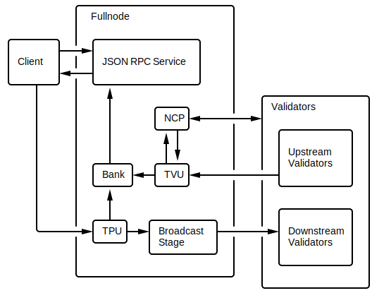

# Fullnode

This document proposes the following architecture changes to fullnode pipeline. 

## Current Architecture

## Proposal

## Background

In the old architecture, the ReplayStage receives entries from the RetransmitStage, 
processes them and writes to the ledger.

In the current code, the ledger write operation has been moved out of the ReplayStage.
If the fullnode is running with a TPU, the Broadcast Service writes to the ledger.
The Retransmit Stage receives entries from peer fullnodes and also writes to the ledger.

The ledger notifies the ReplayStage whenever some entity writes to it. The 
ReplayStage reads from the ledger, processes the entries in the bank and submits
the votes.

In old architecture, the RetransmitStage and ReplayStage are contained in the TVU.

## Changes

This document proposes the following change to the architecture.

1. Split TVU into BlobFetchStage, and ReplayStage
2. Add Blocktree (ledger) to the diagram
3. The Blocktree is updated by Broadcast Service and BlobFetchStage
4. Replay Stage gets notified by Blocktree when someone writes to it
5. Replay Stage submits votes via Gossip Service
6. Replace Bank with BankForks