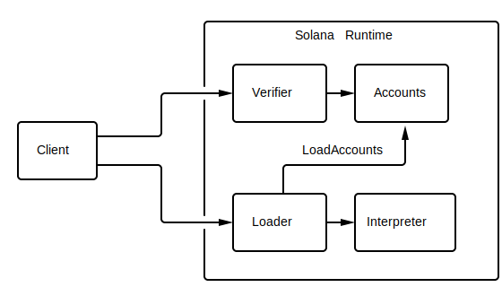

# Programming Model

A client interacts with a Solana cluster by sending it *transactions* with one
or more *instructions*. The Solana *runtime* passes those instructions to
user-contributed *services*. An instruction might, for example, tell a
service to move *tokens* from one *account* to another or create an interactive
*escrow account* that governs how tokens are moved. Instructions are executed
atomically. If any instruction is invalid, any changes made within the
transaction are discarded.

## Deploying Services to a Cluster

As shown in the diagram above a client creates a service and compiles
it to an ELF shared object containing BPF bytecode and sends it to the Solana
cluster. The compiled form is called a *plugin*. The cluster stores the plugin
locally and makes it available to clients via a *service ID*. The service ID is
a *public key* generated by the client and is used to reference the service in
subsequent transactions.

A service may be written in any programming language that can target the
Berkley Packet Filter (BPF) safe execution environment. The Solana SDK offers
the best support for services written in C, which is compiled to a plugin using
the [LLVM compiler infrastructure](https://llvm.org). Alternatively, a client
might choose to bypass LLVM and use Python, Lua or C++ to generate BPF directly
via the [BPF Compiler Collection](https://github.com/iovisor/bcc) (BCC).

## Storing State between Transactions

If the service needs to manage tokens or store state between transactions it is
called an *escrow service*. It manages accounts that hold arbitrary data called
*escrow accounts*. Accounts are similar to files in operating systems such as
Linux.  Like a file, an escrow account may hold arbitrary data and that data
persists beyond the lifetime of a service. Also like a file, an account
includes metadata that tells the runtime who is allowed to access the data and
how.  Unlike a file, the account includes metadata for the lifetime of the
file. That lifetime is expressed in "tokens", which is a number of fractional
native tokens, called *lamports*. Accounts are held in validator memory and pay
"rent" to stay there.  Each fullnode periodically scan all accounts and
collects rent.  Any account that drops to zero lamports is purged.

If an account is marked "executable", it will only be used by a *loader* to load
the plugin stored in the account. For example, a BPF-compiled plugin is marked
executable and loaded by the BPF loader. No service is allowed to modify the
contents of an executable account.

An account also includes "owner" metadata. The owner is a service ID. The
runtime grants the service write access to the account if its ID matches the
owner. If an account is not owned by a service, the service is permitted to
read its data and credit the account.

In the same way that a Linux user uses a path to look up a file, a Solana
client uses public keys to look up accounts. To create an account, the client
generates a *keypair* and registers its public key using the CreateAccount
instruction. Once registered, transactions reference account keys to grant
services access to accounts. The runtime grants services read access by
default. To grant write access, the client must either assign the account to a
service or sign the transaction using the keypair's *secret key*. Since only
the holder of the secret key can produce valid signatures matching the
account's public key, the runtime recognizes the signature as authorization to
modify account data or debit the account.

After the runtime executes each of the transaction's instructions, it uses the
account metadata and transaction signatures to verify that none of the access
rules were violated. If a service violates an access rule, the runtime discards
all account changes made by all instructions and marks the transaction as
failed.
