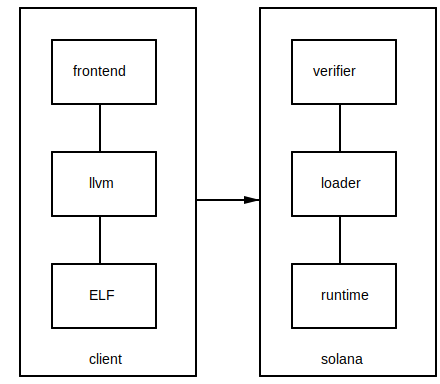

# The LAMPORT execution environment

## Introduction

With LAMPORT (Language-Agnostic, Memory-oriented, Parallel-friendly, Optimized
Run-Time), we can execute smart contracts concurrently, and written in the
client’s choice of programming language. Furthermore, we demonstrate Solana’s
built-in smart contract language Budget can target LAMPORT without any loss in
performance. The two features that allow LAMPORT to work:

Client-owned memory identified by public keys. By declaring ownership upfront
and separating the program’s state from the program, the runtime knows which
contracts can safely be executed concurrently.  Solana’s blockchain-encoded VDF
tells validator nodes at precisely what times they need to end up in the same
state. Between those times, they are free to introduce non-deterministic
behavior as-needed to improve execution times.

## Toolchain Stack

As shown in the diagram above an untrusted client, creates a program in the
front-end language of her choice, (like C/C++/Rust/Lua), and compiles it with
LLVM to a position independent shared object ELF, targeting BPF bytecode.
Solana will safely load and execute the ELF.

