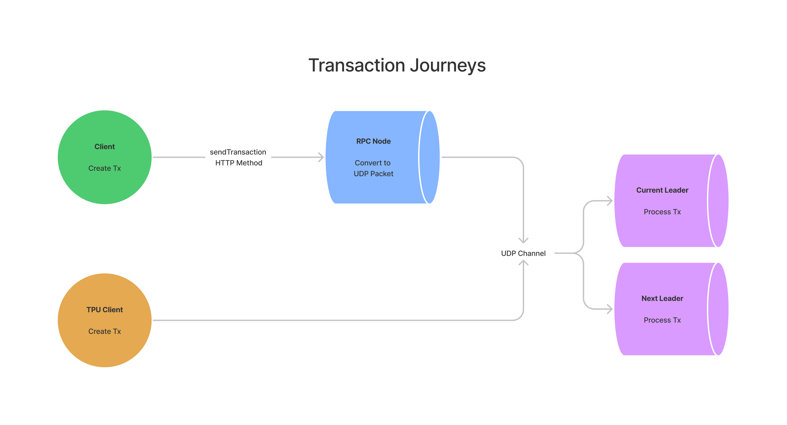
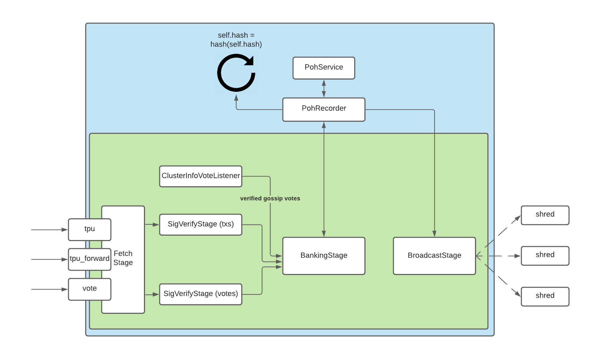
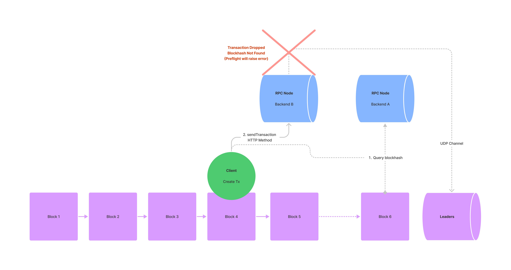
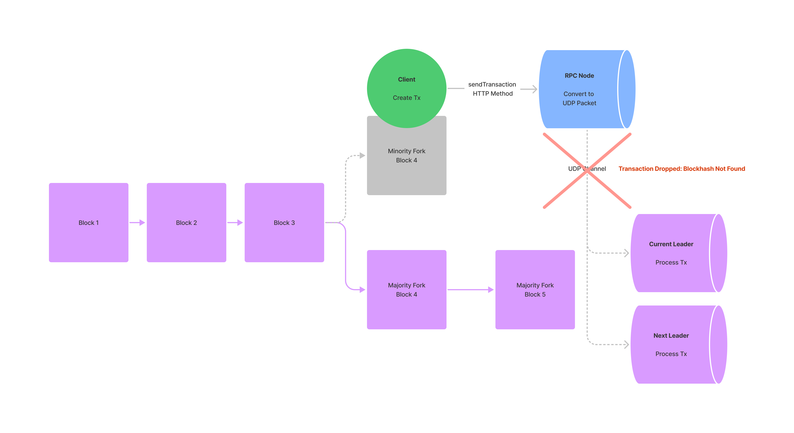
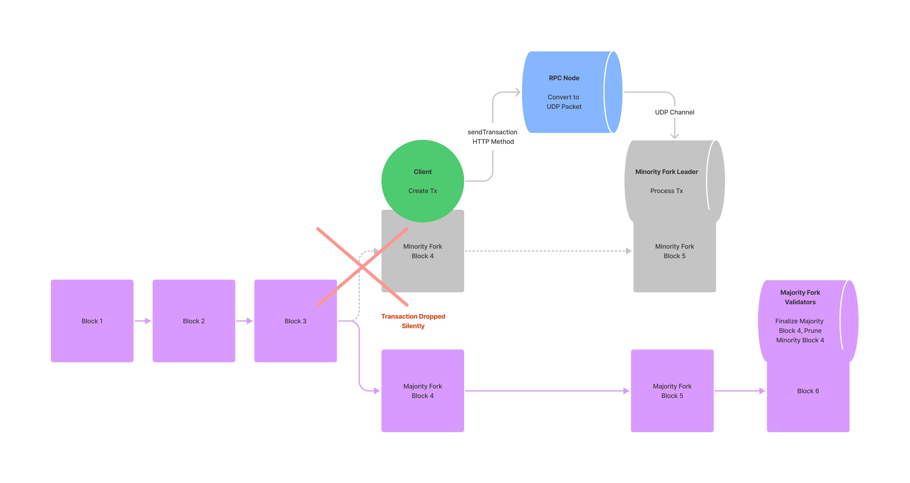

# Retrying Transactions

On some occasions, a seemingly valid transaction may be dropped before it is
included in a block. This most often occurs during periods of network
congestion, when an RPC node fails to rebroadcast the transaction to the
[leader](../terminology#leader). To an end-user, it may
appear as if their transaction disappears entirely. While RPC nodes are equipped
with a generic rebroadcasting algorithm, application developers are also capable
of developing their own custom rebroadcasting logic.

## Facts

:::note
Fact Sheet

- RPC nodes will attempt to rebroadcast transactions using a generic algorithm
- Application developers can implement their own custom rebroadcasting logic
- Developers should take advantage of the `maxRetries` parameter on the
  `sendTransaction` JSON-RPC method
- Developers should enable preflight checks to raise errors before transactions
  are submitted
- Before re-signing any transaction, it is **very important** to ensure that the
  initial transaction’s blockhash has expired

:::

## The Journey of a Transaction

### How Clients Submit Transactions

In Solana, there is no concept of a mempool. All transactions, whether they are
initiated programmatically or by an end-user, are efficiently routed to leaders
so that they can be processed into a block. There are two main ways in which a
transaction can be sent to leaders:

1. By proxy via an RPC server and the
   [sendTransaction](../api/http#sendtransaction)
   JSON-RPC method
2. Directly to leaders via a
   [TPU Client](https://docs.rs/solana-client/1.7.3/solana_client/tpu_client/index.html)

The vast majority of end-users will submit transactions via an RPC server. When
a client submits a transaction, the receiving RPC node will in turn attempt to
broadcast the transaction to both the current and next leaders. Until the
transaction is processed by a leader, there is no record of the transaction
outside of what the client and the relaying RPC nodes are aware of. In the case
of a TPU client, rebroadcast and leader forwarding is handled entirely by the
client software.



<!-- (../../static/img/p_ex_unstaked_dilution.png) -->

### How RPC Nodes Broadcast Transactions

After an RPC node receives a transaction via `sendTransaction`, it will convert
the transaction into a
[UDP](https://en.wikipedia.org/wiki/User_Datagram_Protocol) packet before
forwarding it to the relevant leaders. UDP allows validators to quickly
communicate with one another, but does not provide any guarantees regarding
transaction delivery.

Because Solana’s leader schedule is known in advance of every
[epoch](../terminology#epoch) (~2 days), an RPC node will
broadcast its transaction directly to the current and next leaders. This is in
contrast to other gossip protocols such as Ethereum that propagate transactions
randomly and broadly across the entire network. By default, RPC nodes will try
to forward transactions to leaders every two seconds until either the
transaction is finalized or the transaction’s blockhash expires (150 blocks or
~1 minute 19 seconds as of the time of this writing). If the outstanding
rebroadcast queue size is greater than
[10,000 transactions](https://github.com/solana-labs/solana/blob/bfbbc53dac93b3a5c6be9b4b65f679fdb13e41d9/send-transaction-service/src/send_transaction_service.rs#L20),
newly submitted transactions are dropped. There are command-line
[arguments](https://github.com/solana-labs/solana/blob/bfbbc53dac93b3a5c6be9b4b65f679fdb13e41d9/validator/src/main.rs#L1172)
that RPC operators can adjust to change the default behavior of this retry
logic.

When an RPC node broadcasts a transaction, it will attempt to forward the
transaction to a leader’s
[Transaction Processing Unit (TPU)](https://github.com/solana-labs/solana/blob/cd6f931223181d5a1d47cba64e857785a175a760/core/src/validator.rs#L867).
The TPU processes transactions in five distinct phases:

- [Fetch Stage](https://github.com/solana-labs/solana/blob/cd6f931223181d5a1d47cba64e857785a175a760/core/src/fetch_stage.rs#L21)
- [SigVerify Stage](https://github.com/solana-labs/solana/blob/cd6f931223181d5a1d47cba64e857785a175a760/core/src/tpu.rs#L91)
- [Banking Stage](https://github.com/solana-labs/solana/blob/cd6f931223181d5a1d47cba64e857785a175a760/core/src/banking_stage.rs#L249)
- [Proof of History Service](https://github.com/solana-labs/solana/blob/cd6f931223181d5a1d47cba64e857785a175a760/poh/src/poh_service.rs)
- [Broadcast Stage](https://github.com/solana-labs/solana/blob/cd6f931223181d5a1d47cba64e857785a175a760/core/src/tpu.rs#L136)



Of these five phases, the Fetch Stage is responsible for receiving transactions.
Within the Fetch Stage, validators will categorize incoming transactions
according to three ports:

- [tpu](https://github.com/solana-labs/solana/blob/cd6f931223181d5a1d47cba64e857785a175a760/gossip/src/contact_info.rs#L27)
  handles regular transactions such as token transfers, NFT mints, and program
  instructions
- [tpu_vote](https://github.com/solana-labs/solana/blob/cd6f931223181d5a1d47cba64e857785a175a760/gossip/src/contact_info.rs#L31)
  focuses exclusively on voting transactions
- [tpu_forwards](https://github.com/solana-labs/solana/blob/cd6f931223181d5a1d47cba64e857785a175a760/gossip/src/contact_info.rs#L29)
  forwards unprocessed packets to the next leader if the current leader is
  unable to process all transactions

For more information on the TPU, please refer to
[this excellent writeup by Jito Labs](https://jito-labs.medium.com/solana-validator-101-transaction-processing-90bcdc271143).

## How Transactions Get Dropped

Throughout a transaction’s journey, there are a few scenarios in which the
transaction can be unintentionally dropped from the network.

### Before a transaction is processed

If the network drops a transaction, it will most likely do so before the
transaction is processed by a leader. UDP
[packet loss](https://en.wikipedia.org/wiki/Packet_loss) is the simplest reason
why this might occur. During times of intense network load, it’s also possible
for validators to become overwhelmed by the sheer number of transactions
required for processing. While validators are equipped to forward surplus
transactions via `tpu_forwards`, there is a limit to the amount of data that can
be
[forwarded](https://github.com/solana-labs/solana/blob/master/core/src/banking_stage.rs#L389).
Furthermore, each forward is limited to a single hop between validators. That
is, transactions received on the `tpu_forwards` port are not forwarded on to
other validators.

There are also two lesser known reasons why a transaction may be dropped before
it is processed. The first scenario involves transactions that are submitted via
an RPC pool. Occasionally, part of the RPC pool can be sufficiently ahead of the
rest of the pool. This can cause issues when nodes within the pool are required
to work together. In this example, the transaction’s
[recentBlockhash](../developing/programming-model/transactions#recent-blockhash)
is queried from the advanced part of the pool (Backend A). When the transaction
is submitted to the lagging part of the pool (Backend B), the nodes will not
recognize the advanced blockhash and will drop the transaction. This can be
detected upon transaction submission if developers enable
[preflight checks](../api/http#sendtransaction)
on `sendTransaction`.



Temporarily network forks can also result in dropped transactions. If a
validator is slow to replay its blocks within the Banking Stage, it may end up
creating a minority fork. When a client builds a transaction, it’s possible for
the transaction to reference a `recentBlockhash` that only exists on the
minority fork. After the transaction is submitted, the cluster can then switch
away from its minority fork before the transaction is processed. In this
scenario, the transaction is dropped due to the blockhash not being found.



### After a transaction is processed and before it is finalized

In the event a transaction references a `recentBlockhash` from a minority fork,
it’s still possible for the transaction to be processed. In this case, however,
it would be processed by the leader on the minority fork. When this leader
attempts to share its processed transactions with the rest of the network, it
would fail to reach consensus with the majority of validators that do not
recognize the minority fork. At this time, the transaction would be dropped
before it could be finalized.



## Handling Dropped Transactions

While RPC nodes will attempt to rebroadcast transactions, the algorithm they
employ is generic and often ill-suited for the needs of specific applications.
To prepare for times of network congestion, application developers should
customize their own rebroadcasting logic.

### An In-Depth Look at sendTransaction

When it comes to submitting transactions, the `sendTransaction` RPC method is
the primary tool available to developers. `sendTransaction` is only responsible
for relaying a transaction from a client to an RPC node. If the node receives
the transaction, `sendTransaction` will return the transaction id that can be
used to track the transaction. A successful response does not indicate whether
the transaction will be processed or finalized by the cluster.

:::note

### Request Parameters

- `transaction`: `string` - fully-signed Transaction, as encoded string
- (optional) `configuration object`: `object`
  - `skipPreflight`: `boolean` - if true, skip the preflight transaction checks
    (default: false)
  - (optional) `preflightCommitment`: `string` -
    [Commitment](../api/http#configuring-state-commitment)
    level to use for preflight simulations against the bank slot (default:
    "finalized").
  - (optional) `encoding`: `string` - Encoding used for the transaction data.
    Either "base58" (slow), or "base64". (default: "base58").
  - (optional) `maxRetries`: `usize` - Maximum number of times for the RPC node
    to retry sending the transaction to the leader. If this parameter is not
    provided, the RPC node will retry the transaction until it is finalized or
    until the blockhash expires.

Response

- `transaction id`: `string` - First transaction signature embedded in the
  transaction, as base-58 encoded string. This transaction id can be used with
  [`getSignatureStatuses`](../api/http#getsignaturestatuses)
  to poll for status updates.

:::

## Customizing Rebroadcast Logic

In order to develop their own rebroadcasting logic, developers should take
advantage of `sendTransaction`’s `maxRetries` parameter. If provided,
`maxRetries` will override an RPC node’s default retry logic, allowing
developers to manually control the retry process
[within reasonable bounds](https://github.com/solana-labs/solana/blob/98707baec2385a4f7114d2167ef6dfb1406f954f/validator/src/main.rs#L1258-L1274).

A common pattern for manually retrying transactions involves temporarily storing
the `lastValidBlockHeight` that comes from
[getLatestBlockhash](../api/http#getlatestblockhash).
Once stashed, an application can then
[poll the cluster’s blockheight](../api/http#getblockheight)
and manually retry the transaction at an appropriate interval. In times of
network congestion, it’s advantageous to set `maxRetries` to 0 and manually
rebroadcast via a custom algorithm. While some applications may employ an
[exponential backoff](https://en.wikipedia.org/wiki/Exponential_backoff)
algorithm, others such as [Mango](https://www.mango.markets/) opt to
[continuously resubmit](https://github.com/blockworks-foundation/mango-ui/blob/b6abfc6c13b71fc17ebbe766f50b8215fa1ec54f/src/utils/send.tsx#L713)
transactions at a constant interval until some timeout has occurred.

```ts
import {
  Keypair,
  Connection,
  LAMPORTS_PER_SOL,
  SystemProgram,
  Transaction,
} from "@solana/web3.js";
import * as nacl from "tweetnacl";

const sleep = async (ms: number) => {
  return new Promise((r) => setTimeout(r, ms));
};

(async () => {
  const payer = Keypair.generate();
  const toAccount = Keypair.generate().publicKey;

  const connection = new Connection("http://127.0.0.1:8899", "confirmed");

  const airdropSignature = await connection.requestAirdrop(
    payer.publicKey,
    LAMPORTS_PER_SOL,
  );

  await connection.confirmTransaction({ signature: airdropSignature });

  const blockhashResponse = await connection.getLatestBlockhashAndContext();
  const lastValidBlockHeight = blockhashResponse.context.slot + 150;

  const transaction = new Transaction({
    feePayer: payer.publicKey,
    blockhash: blockhashResponse.value.blockhash,
    lastValidBlockHeight: lastValidBlockHeight,
  }).add(
    SystemProgram.transfer({
      fromPubkey: payer.publicKey,
      toPubkey: toAccount,
      lamports: 1000000,
    }),
  );
  const message = transaction.serializeMessage();
  const signature = nacl.sign.detached(message, payer.secretKey);
  transaction.addSignature(payer.publicKey, Buffer.from(signature));
  const rawTransaction = transaction.serialize();
  let blockheight = await connection.getBlockHeight();

  while (blockheight < lastValidBlockHeight) {
    connection.sendRawTransaction(rawTransaction, {
      skipPreflight: true,
    });
    await sleep(500);
    blockheight = await connection.getBlockHeight();
  }
})();
```

When polling via `getLatestBlockhash`, applications should specify their
intended
[commitment](../api/http#configuring-state-commitment)
level. By setting its commitment to `confirmed` (voted on) or `finalized` (~30
blocks after `confirmed`), an application can avoid polling a blockhash from a
minority fork.

If an application has access to RPC nodes behind a load balancer, it can also
choose to divide its workload amongst specific nodes. RPC nodes that serve
data-intensive requests such as
[getProgramAccounts](https://solanacookbook.com/guides/get-program-accounts.html)
may be prone to falling behind and can be ill-suited for also forwarding
transactions. For applications that handle time-sensitive transactions, it may
be prudent to have dedicated nodes that only handle `sendTransaction`.

### The Cost of Skipping Preflight

By default, `sendTransaction` will perform three preflight checks prior to
submitting a transaction. Specifically, `sendTransaction` will:

- Verify that all signatures are valid
- Check that the referenced blockhash is within the last 150 blocks
- Simulate the transaction against the bank slot specified by the
  `preflightCommitment`

In the event that any of these three preflight checks fail, `sendTransaction`
will raise an error prior to submitting the transaction. Preflight checks can
often be the difference between losing a transaction and allowing a client to
gracefully handle an error. To ensure that these common errors are accounted
for, it is recommended that developers keep `skipPreflight` set to `false`.

### When to Re-Sign Transactions

Despite all attempts to rebroadcast, there may be times in which a client is
required to re-sign a transaction. Before re-signing any transaction, it is
**very important** to ensure that the initial transaction’s blockhash has
expired. If the initial blockhash is still valid, it is possible for both
transactions to be accepted by the network. To an end-user, this would appear as
if they unintentionally sent the same transaction twice.

In Solana, a dropped transaction can be safely discarded once the blockhash it
references is older than the `lastValidBlockHeight` received from
`getLatestBlockhash`. Developers should keep track of this
`lastValidBlockHeight` by querying
[`getEpochInfo`](../api/http#getepochinfo)
and comparing with `blockHeight` in the response. Once a blockhash is
invalidated, clients may re-sign with a newly-queried blockhash.
