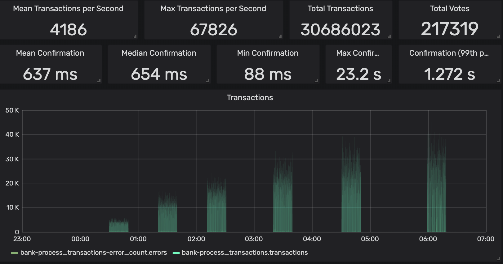

# Dry Run 6

Dry Run 6 will test the performance of a heterogeneous cluster of validators under heavier transaction load. It will be structured as a series of increasing rounds of transactions per second \(TPS\). At the end of each round the validators that survive and produce a block in at least 80% of their leader slots will receive additional stake for the next round. The rounds will continue until the cluster stops making progress.

## Cluster Parameters:

* GPUs optional
* Solana software version: v0.22.2
* Target transaction rate of first round: 2,000 TPS
* Transaction rate round increment: 2,000 TPS
* Epoch duration: 4096 slots \(approximately 27 minutes\)
* Transaction signature fee: 0 lamport
* Genesis allotment to each validator: 2 SOL \(1 SOL for initial delegation, 1 SOL for transaction fees\)
* Round duration: 20 minutes of transactions, followed by 2-3 epochs for stake warm up

## Timeline

### 24 hour onboarding period: Connect, delegate, stake warmup \(approximately 24 hours\)

When the cluster boots, validators will have over 24 hours to connect and delegate 1 SOL of stake to themselves

### Ramp TPS rounds begin! \(approx. 1-2 hours per round\)

Now that all validator stake is active, the Ramp TPS program will begin running the rounds of increasing transactions-per-second until the cluster fails to maintain consensus or TPS cannot be pushed any higher. Each round starts with of 20 minutes of solid transactions. After 20 minutes all validators that remain with the cluster will receive an additional stake delegation. This new stake will also take 3-4 epochs to warm up, and once warm up is complete the next round commences with an increased transaction rate.

## References

* [Ramp TPS program](https://github.com/solana-labs/tour-de-sol/tree/master/ramp-tps)
