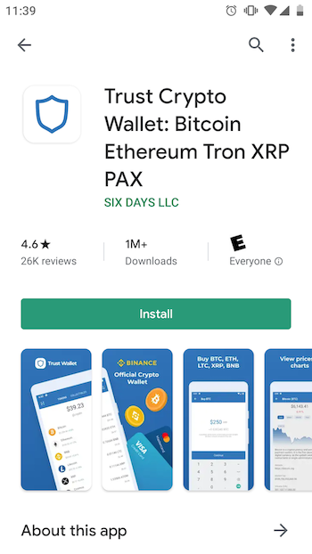
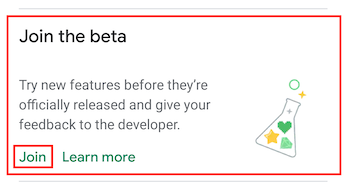
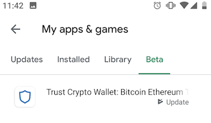
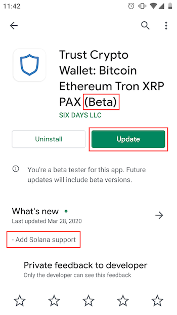

# Trust Wallet
Trust Wallet is an app for your smartphone or tablet and is the fastest and
simplest way for most users to get started with a Solana wallet.

## Install Trust Wallet

#### iOS
 - Open the App Store
 - Download “Trust: Crypto & Bitcoin Wallet” from Six Days LLC
   - Requires iOS 13.0 or higher
 - Open Trust Wallet and follow the app prompts to get started

***

#### Android

**NOTE: At this time, Solana's SOL tokens are only supported in the Beta version
of Trust Wallet for Android.  The following steps explain how to install this
Beta version to start using your Solana wallet. Check back here or check the
latest official Trust Wallet release notes for when support is added to their
official Android release.**

 - Open the Play Store
 - Download the official version of Trust Wallet
   - “Trust: Crypto & Bitcoin Wallet” from Six Days LLC
   - Requires Android 6.0 or higher

##### Enable Beta version of Trust Wallet
 - Make sure you already have the official version installed
 - Open Play Store and view Trust Wallet's app page
 - Scroll down to the bottom to the "Beta" section and tap "Join"
 - It may take a few minutes for your device to get access to the Beta version

##### Upgrade to the Beta version
 - Open Play Store .
 - Tap Menu --> My apps and games --> Beta.
 - Tap Trust Wallet
 - Tap Upgrade when brought back to the Trust Wallet (Beta) install page

***

##### Beta Install Support for Android
 - [Google's Official Help for Installing Beta Versions of Apps](https://support.google.com/googleplay/answer/7003180?hl=en)

## Add Solana (SOL) tokens to your wallet
 - From the main page, go to the “Tokens” tab at the top of the screen
 - Tap the “+” icon at the top right corner
 - Search for “Solana” in the search page, and when the “Solana SOL” token is
shown, slide the slider to enable this token.
 - You can now tap the Solana icon to access your Solana wallet.

[Trust Wallet Official Docs: How to Add or Remove a Coin](https://community.trustwallet.com/t/how-to-add-or-remove-a-coin/896)

## Receiving SOL tokens
 - To receive SOL tokens that you’ve purchased or earned, you need to send your
Receive Address to whoever is sending you tokens.
 - Tap “Receive” to view a QR code and your text address, which is a long string
 of letters and numbers.
 - Tap “Copy” or “Share” to send the address.
 - Be very careful when you copy and paste your receive address anywhere that
you do not miss any characters at the beginning or end of the string.
 - If you send an incorrect Receive address to someone and they send tokens
to that address, **those tokens will be lost forever**.

[Trust Wallet Official Docs: How to Find my Receiving Address](https://community.trustwallet.com/t/how-to-find-my-receiving-address/2006)

## Sending SOL tokens
You can send SOL from your Trust Wallet to any other valid address on the Solana
network.  Once you know the other party's receiving address,
go to the main page of the wallet from which you want to send some SOL tokens:
 - Tap the "Solana" icon.
 - Tap "Send"
 - Under "Recipient Address":
   - If you already have the receiving address you are going to send to,
   tap "Paste"
   - If you are transferring to another Trust Wallet user, you can use the app's
   QR code reader by tapping the square icon to the right of the "Paste" button.
 - Under "Amount", enter the amount of SOL you want to send, or tap "Max"
   to send **all** of the SOL in your wallet to the new address
 - Tap "Next" to view a summary/confirmation page to review before submitting
  the transaction
    - The real-time network transaction fee will be shown.  This fee will be
    paid by the sending account in addition to the full amount transferred.
      - If you chose to send all your tokens to the new address by selecting
      "Max" under amount, the amount sent to the recipient will be the account
      balance *minus* the current network transaction fee.
    - **Make sure you entered the "To" address correctly and that it matches your
    desired wallet's receiving address!**
 - Tap "Send" to submit the transaction.  The transaction will show as "Pending"
 for a few seconds, and then will show as "Sent".

[Trust Wallet Official Docs: Sending Cryptocurrencies](https://community.trustwallet.com/t/sending-cryptocurrencies/65)

## Using Multiple Wallet Addresses
Trust Wallet allows you to create multiple wallets, each of which is
secured by a different set of random seed words.  If you want to use more than
one Solana address, follow these steps.

#### Create an additional wallet
 - In the main page of the Trust Wallet App, tap "Settings" in the bottom-right
 corner.
 - Tap "Wallets"
 - Tap "+" to create a new Wallet
 - Follow the steps above to add SOL tokens to your new wallet

*Note: In the "Wallets" page under "Settings" you can re-name each of your wallets.
 Consider giving each a descriptive name if you are planning to use your wallets
 for different purposes, so you don't mistake one for the other.*

#### Transferring SOL between your wallets
Just like you can transfer SOL to another party, you can transfer SOL between
wallets that you own.

 - Copy the receive address of your **newly created** wallet.
   - Make sure your **new** wallet is selected by going to
   "Settings" --> "Wallets", then tap on the name of your new wallet.
   - Tap the "Solana" icon.
   - Tap "Receive" then tap "Copy".
 - Select your previous/original wallet which already has some SOL by going to
 "Settings" --> "Wallets", then tap on the name of your **original** wallet.
   - Now follow the same process for [sending SOL tokens](#sending-sol-tokens)
    using your **new** wallet's receiving address as the address in the "To"
    field when you make the transfer.

## Troubleshooting
If you are having trouble setting up your Trust Wallet app, check out their
 [Community Help Center](https://community.trustwallet.com/c/helpcenter)

## Support

Check out our [Wallet Support Page](../wallet/support.md) for ways to get help.
