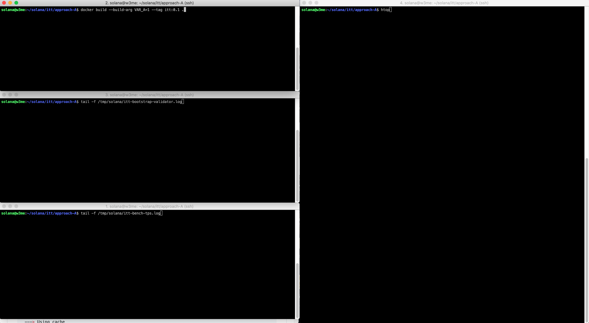
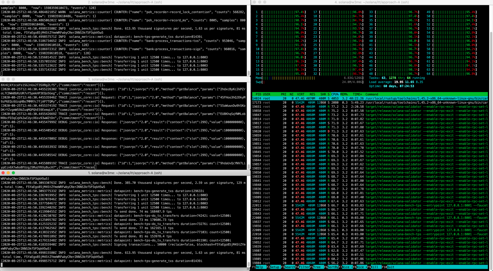
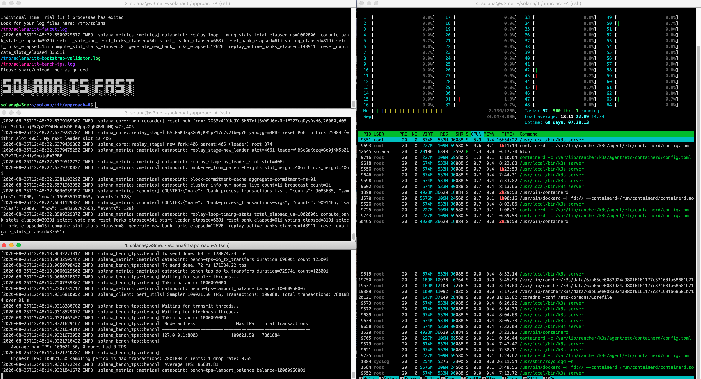

## Approach A

### Steps
- change your working directory
- build docker image
- list docker image
- run docker image
- check log files


### Commands & Outputs

c0
```bash
cd $HOME/solana/itt/approach-A
```

c1 build docker solana image
```bash
docker build --build-arg VAR_A=1 --build-arg VAR_B=$(id -u) --build-arg VAR_C=$(id -g) --tag itt-solana:0.3 .
```
o1
```bash
Step 1/20 : FROM rust:latest
 ---> 8bc1c343b904
Step 2/20 : ARG VAR_A=1
 ---> Using cache
 ---> f9e66b6c493d
Step 3/20 : ENV NDEBUG=$VAR_A
 ---> Using cache
 ---> b2e721ee0147
Step 4/20 : ARG VAR_B=1001
 ---> Using cache
 ---> 8c73047fd450
Step 5/20 : ENV USER_ID=$VAR_B
 ---> Using cache
 ---> c2b5418961fd
Step 6/20 : ARG VAR_C=1001
 ---> Using cache
 ---> b1ff581df94d
Step 7/20 : ENV GROUP_ID=$VAR_C
 ---> Using cache
 ---> 3811c468a5bc
Step 8/20 : USER root
 ---> Using cache
 ---> d2c60f28d5d8
Step 9/20 : RUN apt-get update && apt-get install -y sudo apt-utils libudev-dev clang gcc make lolcat toilet toilet-fonts tree
 ---> Using cache
 ---> 435043442695
Step 10/20 : RUN addgroup --gid $GROUP_ID solana
 ---> Using cache
 ---> e667e45bd6a3
Step 11/20 : RUN adduser --disabled-password --gecos 'solana' --uid $USER_ID --gid $GROUP_ID solana &&   usermod -aG sudo solana
 ---> Using cache
 ---> a2e13917dee4
Step 12/20 : RUN mkdir -p /tmp/solana/itt &&   chmod -R +w /tmp/solana
 ---> Using cache
 ---> 5ff17574818e
Step 13/20 : WORKDIR /home/solana
 ---> Using cache
 ---> 6b1783b2563a
Step 14/20 : RUN git clone https://github.com/solana-labs/solana.git
 ---> Using cache
 ---> b870f797999f
Step 15/20 : RUN cd solana &&   TAG=$(git describe --tags $(git rev-list --tags --max-count=1)) &&   git checkout $TAG &&   cargo build --release
 ---> Using cache
 ---> b4cb6c6f2bdb
Step 16/20 : RUN cd solana &&   NDEBUG=$NDEBUG ./multinode-demo/setup.sh
 ---> Using cache
 ---> e2cf011a98db
Step 17/20 : COPY --chown=$USER_ID:$GROUP_ID solana_itt_script.sh solana/solana_itt_script.sh
 ---> Using cache
 ---> 2f2d881d250c
Step 18/20 : RUN chmod +x solana/solana_itt_script.sh
 ---> Using cache
 ---> 0b48460dc1ba
Step 19/20 : WORKDIR solana
 ---> Using cache
 ---> b05b298df6c8
Step 20/20 : CMD ./solana_itt_script.sh
 ---> Using cache
 ---> 3a840f7fe714
Successfully built 3a840f7fe714
Successfully tagged itt-solana:0.3
```

c2: list docker images
```bash
docker images
```
o2
```
REPOSITORY                               TAG                 IMAGE ID            CREATED             SIZE
itt-solana                               0.3                 3a840f7fe714        29 minutes ago      4.38GB
```

c3: run docker image
```bash
docker run -it --rm -v /tmp/solana/itt:/tmp/solana/itt itt-solana:0.3
```

c4: check log files
```bash
tree /tmp/solana
```
o4
```
/tmp/solana
├── itt-bench-tps.log
├── itt-bootstrap-validator.log
└── itt-faucet.log

0 directories, 3 files
```


Some useful Docker commands
```bash
docker ps
docker rm -f <CONTAINER ID>
docker images
docker rmi -f <IMAGE ID>
docker logs
```


### Setup, Run, Complete






